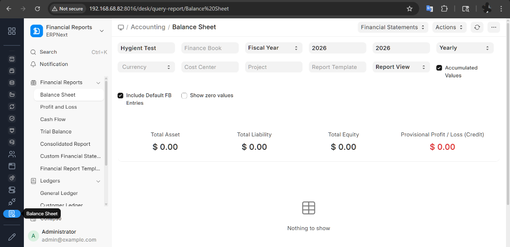
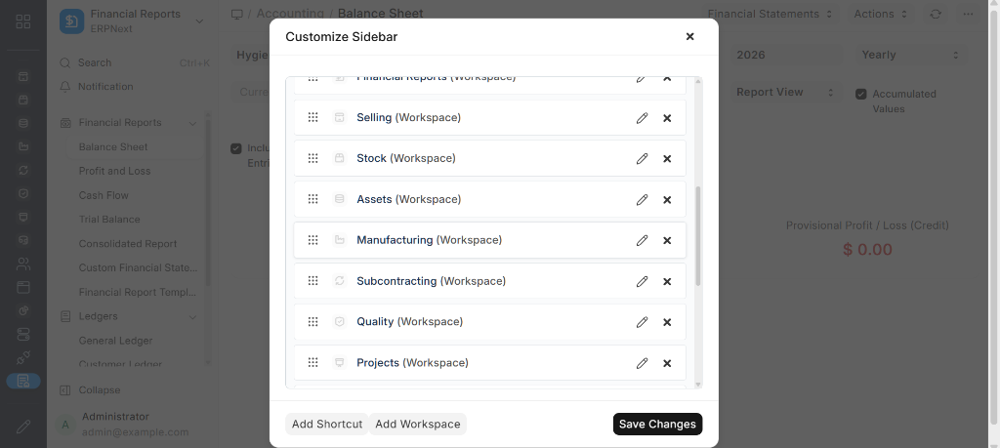
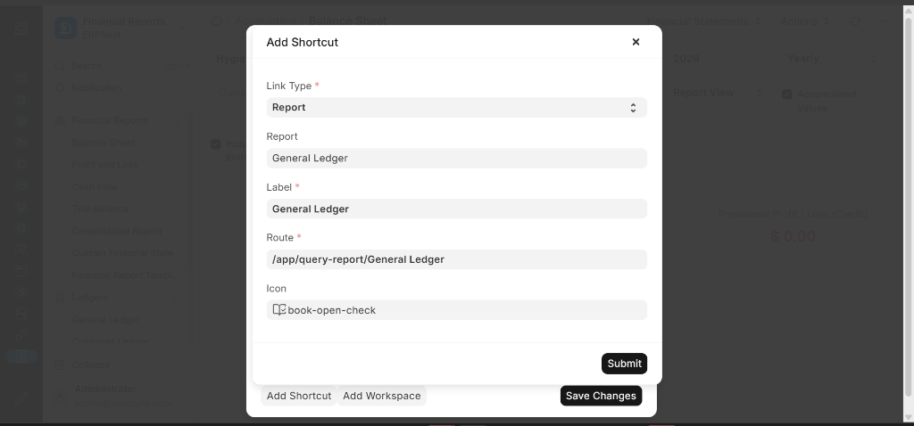

# SlimDesk Navigator for Frappe v16
**Persistent, Unobtrusive Sidebar Navigation to Solve Context Switching Fatigue.**

## The Problem
In the standard Frappe v16 UI, navigating between different modules (e.g., *Buying* to *Selling*) often requires returning to the main "Home" grid or Desk. This constant context switching interrupts workflow and makes it easy to lose track of open tasks.

## The Solution
**SlimDesk Navigator** injects a permanent, slim sidebar on the left side of every application page. It acts as a visual anchor, allowing you to jump between modules in **one click** without losing your current page context.

### Key Features
*   **Persistent & Unobtrusive:** Always accessible, taking up minimal screen real estate (60px).
*   **Dark Theme:** Sleek sidebar aesthetics with a dedicated dark mode (`#1a202c`) and high-contrast active states.
*   **Smart Shortcuts:** Add shortcuts to **DocTypes, Reports, or Pages**.
*   **Context Retention:** Switch apps without returning to the "Desktop" grid.
*   **Auto-Discovery:** Automatically detects icons for your installed apps.
*   **Fully Customizable:** Drag & drop reordering via a simple "Edit" dialog.

## Screenshots

### Persistent Sidebar
The sidebar stays with you across different modules, providing a stable visual anchor.


### Customization
Easily reorder, hide, or edit items with a simple drag-and-drop interface.


### Smart Shortcuts
Add shortcuts to DocTypes, specific Reports, or Pages.



## Installation

1.  **Get the App**
    ```bash
    bench get-app v16_slim_desk https://github.com/zerodiscount/v16_slimdesk_navigator
    ```

2.  **Install on Site**
    ```bash
    bench --site [your-site] install-app v16_slim_desk
    ```

3.  **Build Assets**
    ```bash
    bench build --app v16_slim_desk
    bench clear-cache
    ```

## Usage
*   **Access:** The sidebar appears automatically for all System Users.
*   **Customize:** Click the **Edit (Pencil)** icon at the bottom.
*   **Home:** Click the top **Grid** icon to return to the standard Frappe Desk.

## Compatibility
*   **Frappe Framework:** v15, v16+
*   **ERPNext:** v15, v16+
